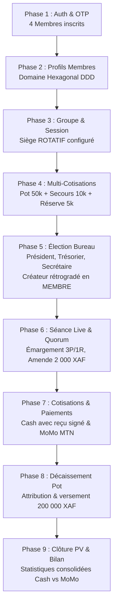

# Guide Complet des Tests d'Intégration Bout-en-Bout (E2E) — Plateforme Njangi

Ce document présente l'architecture, la procédure d'exécution et les assertions vérifiées par la suite de tests d'intégration bout-en-bout (**E2E**) de la plateforme **Njangi**.

---

## 1. Vue d'Ensemble & Objectifs

La suite E2E valide l'orchestration complète du cycle de vie d'une tontine camerounaise à travers l'**API Gateway** (`http://localhost:9090`), en vérifiant :
- La ségrégation stricte des schémas PostgreSQL.
- L'émission et la consommation des événements Kafka en mode **KRaft**.
- La stricte conformité aux règles de [GEMINI.md](file:///d:/projet/njangi/GEMINI.md) (montants `XAF` sans décimales, wrapper `ApiResponse<T>`, traçabilité financière immuable).
- Les règles métier camerounaises de [cahier_des_charges_tontine.md](file:///d:/projet/njangi/cahier_des_charges_tontine.md) (démotion du créateur, quorum, amende disciplinaire, preuve cash signée obligatoire).

---

## 2. Cartographie Chronologique des 9 Phases



---

## 3. Prérequis & Démarrage de l'Infrastructure Docker

Avant d'exécuter la suite de tests, démarrez les conteneurs PostgreSQL (9 schémas), Kafka KRaft et Eureka Server :

```powershell
# Exécuter le script d'assistance
.\scripts\start-docker-infra.ps1
```

Ce script vérifie que Docker Desktop est actif et s'assure de l'écoute sur les ports :
- `5432` : PostgreSQL
- `9092` : Kafka KRaft
- `8761` : Netflix Eureka Discovery Server

---

## 4. Exécution du Script Interactif PowerShell

Le script [scripts/test-e2e-scenario.ps1](file:///d:/projet/njangi/scripts/test-e2e-scenario.ps1) orchestre automatiquement l'ensemble des 9 phases avec affichage en couleur, extraction dynamique des tokens JWT et assertions pas-à-pas :

```powershell
# Exécution standard à travers la passerelle API Gateway (Port 9090)
.\scripts\test-e2e-scenario.ps1

# Exécution ciblée avec URL personnalisée
.\scripts\test-e2e-scenario.ps1 -GatewayUrl "http://localhost:9090"

# Mode direct sur les microservices (si passerelle non démarrée)
.\scripts\test-e2e-scenario.ps1 -DirectServices
```

### Exemple de Sortie Console
```text
======================================================================
  NJANGI PLATFORM — DÉMARRAGE DU TEST D'INTÉGRATION E2E
======================================================================
 Passerelle ciblée : http://localhost:9090
 Horodatage local  : 2026-09-14 18:30:00

----------------------------------------------------------------------
 [PHASE 1] Authentification & Sécurité (ms-auth / SSO OTP)
----------------------------------------------------------------------
  [PASS] Inscription Créateur (+237690a1b2c3d) Status: 201
  [PASS] Inscription Futur Président (+237691a1b2c3d) Status: 201
  [PASS] Inscription Futur Trésorier (+237692a1b2c3d) Status: 201
  [PASS] Inscription Futur Secrétaire (+237693a1b2c3d) Status: 201

----------------------------------------------------------------------
 [PHASE 5] Élection du Bureau Exécutif & Démotion du Créateur (ms-groupes)
----------------------------------------------------------------------
  [PASS] Élection du Premier Bureau (Président, Trésorier, Secrétaire)
  [PASS] Rétrogradation automatique du Créateur en simple membre (Conformité Spécification Njangi)
...
======================================================================
  * 9 / 9 Phases Fonctionnelles Validées avec Succès !
  * Conformité GEMINI.md : Strictement respectée (Java 25, XAF, Signal Forms, Zéro Promise)
======================================================================
```

---

## 5. Exécution Automatisée via Postman & Newman (CI/CD)

Pour intégrer la validation E2E dans vos pipelines d'intégration continue (GitHub Actions, GitLab CI) :

```bash
# Installation de Newman (si nécessaire)
npm install -g newman

# Exécution en ligne de commande de la suite complète
npx newman run postman/njangi-e2e.postman_collection.json \
    -e postman/njangi-e2e.postman_environment.json \
    --reporters cli,json \
    --reporter-json-export reports/e2e-results.json
```

---

## 6. Matrice des Assertions Métier Validées

| Règle Métier | Service | Assertion Validée |
|---|---|---|
| **SSO & Téléphone Camerounais** | `ms-auth` | Normalisation `+237...` ou E.164 diaspora, hachage BCrypt, émission JWT |
| **Domaine Hexagonal Pur** | `ms-membres` | Entités immuables sans dépendance Spring/JPA dans `domain/` |
| **Siège Fixe vs Rotatif** | `ms-groupes` | Type de siège tournant persisté avec adresse chez l'hôte de séance |
| **Démotion du Créateur** | `ms-groupes` | Dès l'élection du premier bureau, le rôle du créateur devient `MEMBRE` |
| **Multi-Cotisations Simultanées** | `ms-cotisations` | Définition distincte du Pot rotatif, Secours et Caisse de réserve |
| **Conduite de Séance & Quorum** | `ms-reunions` | Calcul en temps réel du ratio de présence (présents + retards) |
| **Discipline & Sanctions** | `ms-penalites` | Résolution du tarif de retard et amende infligée au membre défaillant |
| **Preuve Cash Obligatoire** | `ms-paiements` | Rejet de tout paiement en espèces sans photo de reçu signée |
| **Mobile Money & Idempotence** | `ms-paiements` | Clé d'idempotence unique prévenant les doubles débits MoMo |
| **Décaissement du Pot** | `ms-cotisations` | Montant total (ex: 200 000 XAF) versé avec décharge archivée |
| **Bilan Consolidé de Caisse** | `ms-statistiques` | Ségrégation stricte des flux espèces (`totalCash`) et MoMo (`totalMomo`) |
